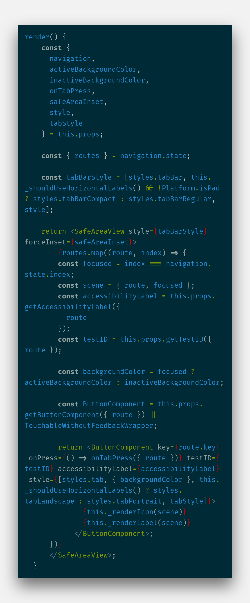

> RN 项目中使用 react-navigation 实现动态底部菜单，用于限制不同用户的权限

<!-- more -->

## 需求

这是去年 App 项目提出的一个需求，因为我们做的这个 App 区分了很多渠道，同时登录用户也有很多状态，一些菜单需要动态的显示隐藏。项目是使用的 React-Native 框架，路由库选择官方推荐的 react-navigation，所以要实现这个需求，必须是改动 react-navigation 的配置。但是 react-navigation 的文档非常扯淡，react-navigation 的文档是这样写的：

> 使用动态路由，需要对 React-Navigation 有一点了解才能充分发挥。React-Navigation 要求你静态的定义你的路由，如果你一定要使用动态路由，也有解决方案，但可能会有一些额外的复杂度。

what?你以为会有后续告诉我们解决方案是什么吗，文档写到这就没了，这不是脱了裤子放屁吗，既然说了有解决方案，又不给我说具体解决方案是什么。引用罗老师的名言：<u>我怀疑你在外面有六个私生子，但我不能告诉你是谁 😏</u>


## 好几个不同的解决方案

最终完美解决这个需求经历了 3 次方案更改：

1. 第一次的方案：直接在根级组件处定义一个状态，根据后端返回的状态不同生成不同的 react-navigation 配置。这种方案虽可以解决问题，但是性能上有一个很大的问题，因为 react-navigation 是惰性加载页面组件的，也就是说只有导航到了这个页面才会渲染该页面组件，并且只要此页面未被移除 react-navigation 的路由栈，后续再导航到此页面是不会经历重新构建页面组件的流程的。在根级组件处根据 state 来重新渲染会让整个根组件重新 render，并且因为直接产生新的 react-navigation 根导航组件，在用户视觉上会有一个页面闪烁的感觉，对于用户体验来说是不友好的。
2. 第二次方案，将底部菜单作为单独的导航系统来使用，虽然 react-navigation 要求项目中只能使用一个导航系统，但是实际这样用并不会报错，只不过会在 ios 系统上有警告。这种实现动态底部菜单的好处就是不会有闪烁，并且也只会重渲染这个单独的底部导航组件，不会整个根组件重新渲染。缺点是使用了两套导航系统，在底部菜单这个组件上的导航与整个 App 页面的导航使用的是不同的 navigation，需要在不同的页面使用不同的导航方式，并且无法在其他页面直接导航到底部菜单中的某一个子菜单。
3. 第三次方案，这应该是目前最完美的方案了，只使用一套导航系统，而且动态改变菜单只需要刷新底部导航栏。

## 代码部分

### 方案一：根组件控制导航菜单

```js
//先定义两个不同的底部组件，根据用户权限决定使用哪个
//三个菜单： 首页，个人中心，和商品推荐页面，根据用户权限决定是否显示商品推荐页面
// App.js
const tabbarRoutes = {
  首页: Home,
  商品推荐: LoanMarket,
  个人中心: MyInfo
};

const anotherRoutes = {
  首页: Home,
  个人中心: MyInfo
};

const MyTabRouter = createBottomTabNavigator(tabbarRoutes);

export default class App extends Component {
  state = {
    showMarket: false
  };

  componentDidMount = () => {
    // 这里监听一个事件，如果需要显示商品推荐页面，则将showMarket置为true
    this.subscribe = DeviceEventEmitter.addListener("showMarket", () => {
      this.setState({
        showMarket: true
      });
    });
  };

  componentWillUnmount = () => {
    this.subscribe && this.subscribe.remove();
  };

  render() {
    const tabRoutes = this.state.showMarket ? tabbarRoutes : anotherRoutes;
    const MyTabRouter = createBottomTabNavigator(tabRoutes);
    // 一个系统一般不可能只有一个页面，这里简便只定义一个路由
    const AppStack = createStackNavigator({
      tabbar: {
        screen: MyTabRouter,
        navigationOptions: {
          header: null
        }
      }
    });
    return <AppStack />;
  }
}
```

### 方案二：独立的底部导航系统

```js
// App.js
import TabbarScreen from './tabbar';
import LoginScreen from './login';

const AppStack = createStackNavigator({
  login: {
    screen: LoginScreen,
    navigationOptions: {
      header: '登录'
    }
  }
  tabbar: {
    screen: TabbarScreen,
    navigationOptions: {
      header: null
    }
  }
});

export default class App extends Component {
  render() {
    return <AppStack />;
  }
}

//tabbar.js
const routes = {
  首页: Home,
  商品推荐: LoanMarket,
  个人中心: MyInfo
};

const anotherRoutes = {
  首页: Home,
  个人中心: MyInfo
};

export default class Tabbar extends Component {
  state = {
    showMarket: false
  }

  componentDidMount = () => {
    // 这里监听一个事件，如果需要显示商品推荐页面，则将showMarket置为true
    this.subscribe = DeviceEventEmitter.addListener('showMarket', () => {
      this.setState({
        showMarket: true
      });
    });
  };

  componentWillUnmount = () => {
    this.subscribe && this.subscribe.remove();
  };

  render() {
    const tabRoutes = this.showMarket ? routes : anotherRoutes
    return React.createElement(createBottomTabNavigator(tabRoutes));
  }

}

// 注意：使用这种方案的时候，tabbar页面其实是与App导航系统独立的一个导航系统，以下举例
//我现在处于Login页面，想跳转到tabbar页面：
this.props.navigation.navigate('tabbar'); //成功跳转
// 我现在处于tabbar中Home页面，我现在想跳转Login：
this.props.navigation.navigate('login'); //不会有任何效果，因为这个navigation只是tabbar中的navigation，不能导航到tabbar路由以外的页面。
// 我现在处于Login页面，想跳转到tabbar中的个人中心（MyInfo)
this.prop.navigation.navigate('个人中心'); //无效，因为顶层导航中根本没有这条导航路线

/*解决tabbar中页面跳转其他页面的问题：
使用顶层导航，即在App.js中设置顶层导航为AppStack的navigation，在tabbar中想跳转tabbar之外的页面就使用导出的顶层导航进行跳转。
*/

//第二个问题，想在其他页面直接跳转到tabbar中某个页面，这种方案下无法解决
```

### 方案三：自定义底部导航栏

这个方案是我看过 react-navigation 中 createBottomTabNavigator 中的部分源码才想到的一个方案,createBottomTabNavigator 支持传入一个自定义的 tabBarComponent，也就是下图这个东西：


但是如果真要完全自己写个这东西感觉不现实啊，毕竟涉及到不同机型分辨率的适配处理，以及路由跳转的逻辑。但我还是去看了 createBottomTabNavigator 的源码，我看源码中 tabBarComponent 是怎样处理的： createBottomTabNavigator 是在 react-navigation-tabs 这个包中，使用的 tabbarComponent 在 react-navigation-tabs/dist/views/BottomTabBar.js, 部分源码如下图：



可以看到决定在 tabBarComponent 渲染几个按钮的关键就是 props.navigation.state 的 routes 和 index,而且 props 中 navigation 就只用到了这个属性，并没有使用 navigation 的其他功能，所以我的想法就是单独引入这个 BottomTabBar 组件，然后再基于这个封装自己的 BottomTabBar。

```js
//tabbar.js
import { BottomTabBar } from "react-navigation-tabs";

const tabbarRoutes = {
  首页: Home,
  商品推荐: LoanMarket,
  我的: MyInfo
};

const originalRoutes = [
  { key: "首页", routeName: "首页", params: undefined },
  { key: "商品推荐", routeName: "商品推荐", params: undefined },
  { key: "我的", routeName: "我的", params: undefined }
];

//自定义BottomTabBar
class CustomBottomTabBar extends PureComponent {
  state = {
    showMarket: false
  };

  componentDidMount = () => {
    // 这里监听一个事件，如果需要显示商品推荐页面，则将showMarket置为true
    this.subscribe = DeviceEventEmitter.addListener("showMarket", () => {
      this.setState({
        showMarket: true
      });
    });
  };

  componentWillUnmount = () => {
    this.subscribe && this.subscribe.remove();
  };

  // 这里对navigation进行处理，注意这里不能直接修改props.navigation,会报错，
  //所以只需要传入一个自定义的navigation，而BottomTabBar只会用到navigation.state中routes和index,
  //所以就构造这么一个虚假的navigation就可以了
  dealNavigation = () => {
    const { routes, index } = this.props.navigation.state;
    // 根据是否需要显示商品推荐菜单来决定state中的routes
    let finalRoutes = originalRoutes;
    if (!this.state.showMarket) {
      finalRoutes = originalRoutes.filter(route => route.key !== "商品推荐");
    }
    const currentRoute = routes[index];
    return {
      state: {
        index: finalRoutes.findIndex(route => currentRoute.key === route.key), //修正index
        routes: finalRoutes
      }
    };
  };

  render() {
    const { navigation, ...restProps } = this.props;
    const myNavigation = this.dealNavigation();
    return <BottomTabBar {...restProps} navigation={myNavigation} />;
  }
}

const MyTabRouter = createBottomTabNavigator(tabbarRoutes, {
  navigationOptions: tabRouterConfig.navigationOptions,
  tabBarOptions: tabRouterConfig.tabBarOptions,
  tabBarComponent: CustomBottomBar
});

export default class Tabs extends PureComponent {
  //这里必须有这个静态属性，表示将这个页面视为一个navigator，这样才能和AppStack共用一套导航系统
  static router = MyTabRouter.router;
  render() {
    return <MyTabRouter navigation={this.props.navigation} />;
  }
}
```

这种方案是最好的方案，在一开始就静态定义所有可能用到的路由，然后在底部菜单这里做文章，根据用户的权限来决定隐藏或显示某个路由入口，而且整个 App 也都用同一个 navigation 进行导航，就是想去哪儿就去哪儿，cool
