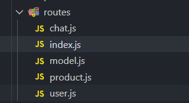

# 使用require.context实现自动化操作

> require.context是webpack提供的一个批量引入模块文件的api

## 如何使用

1. 语法： `require.context(directory, useSubdirectories, regExp)`
   - directory{string}: 需要遍历的文件夹路径
   - useSubdirectories{Boolean}: 是否遍历文件夹下的子目录
   - regExp{RegExp>}匹配文件的正则

2. require.context的返回值为一个函数，该函数有三个属性(注意是函数的属性),同时此函数也接收一个参数<模块名>，通过模块名导入模块并返回导入的模块（跟import导入方式导入的模块一样）
   - resolve {Function} -接受一个参数request,request为文件夹下面匹配文件的相对路径,返回这个匹配文件相对于整个工程的相对路径
   - keys {Function} -返回匹配成功模块的名字组成的数组（也就匹配成功的文件名），其中的值也是作为require.context返回的函数的参数
   - id {String} -执行环境的id,返回的是一个字符串,主要用在module.hot.accept,应该是热加载

3. 实际应用

```js
// 遍历src目录及其子文件夹，找到所有以index.js结尾的文件
// src目录下有一个文件index.js
const req = require.context('./src',true, /index\.js$/)
console.log(req.keys()); // ['./index.js']
console.log(req.resolve(req.keys[0])); // ['./src/index.js']
const module = req(req.keys[0]) //module即为导入index.js得到的模块
```
**业务中的应用**

例如在vue项目中，导出路由文件注册，对于一个大型的项目来说，路由配置文件肯定是需要划分为好几个不同的文件，但最后注册路由时，需要将所有配置文件中的路由信息到导出到一起集中注册，那么这时候require.context就该派上用场了。

有如下路由文件目录



如果不使用require.context的方案，则需要手动引入每一个路由配置文件，如果后期又有新的业务范围划分，那么势必得新增新的路由配置文件，同时又得在index.js中手动引入
```js
// index.js
import VueRouter from 'vue-router';
import chat from './chat';
import model from './model';
import product from './product';
import user from './user';

export default new VueRouter({
  routes: [...chat, ...model, ...product, ...user],
  mode: 'hash',
});

```

使用require.context的话，就方便的多了，不用手动引入路由配置文件，且后期无论是增删配置配置文件都能自动导入，如下使用：

```js
import VueRouter from 'vue-router';
// 遍历当前目录中不以index.js结尾的文件
const req = require.context('.', false, /(?<!index)\.js$/);
// 导入所有路由
const routes = req.keys().reduce((routes, moduleName) => {
  const route = req(moduleName);
  return routes.concat(route.default || route);
}, []);

export default new VueRouter({
  routes: routes,
  mode: 'hash',
});

```