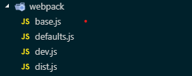

## 版本升级
项目之前一直是使用的 webpack1.x 版本，比较老了，所以跟组长商量了下，升级到 webpack4.x 版本。

这是升级后版本：

```json
"devDependencies": {
  "webpack": "^4.26.1",
  "webpack-bundle-analyzer": "^3.3.2",
  "webpack-cli": "^3.1.2",
  "webpack-dev-server": "^3.2.0",
  "webpack-merge": "^4.2.1"
}
```

## webpack配置文件

还是按照配置拆分的原则，将webpack配置文件分为了几个不同的文件：



### base.js

```js
//base.js
//这个文件下主要定义了生产和开发下通用的一些配置，如模块别名，静态资源
'use strict';
let defaultSettings = require('./defaults');
const CopyWebpackPlugin = require('copy-webpack-plugin');
const path = require('path');

const staticAssets = [
  { from: path.resolve(defaultSettings.staticPath, 'china.js'), to: 'assets' },
  { from: path.resolve(defaultSettings.staticPath, 'cdn'), to: 'assets' }
];

module.exports = {
  devtool: 'eval',
  plugins: [new CopyWebpackPlugin(staticAssets)],
  resolve: {
    extensions: ['.js', '.jsx'],
    alias: {
      'react-dom': '@hot-loader/react-dom',
      utils: `${defaultSettings.srcPath}/utils/`,
      common: `${defaultSettings.srcPath}/common/`,
      routes: `${defaultSettings.srcPath}/routes/`,
      components: `${defaultSettings.srcPath}/components/`,
      styles: `${defaultSettings.srcPath}/styles/`,
      config: `${defaultSettings.srcPath}/config/` + process.env.REACT_WEBPACK_ENV,
      'react/lib/ReactMount': 'react-dom/lib/ReactMount',
      static: `${defaultSettings.srcPath}/static/`
    }
  },
  module: {}
};
```

### defaults.js

```js
//defaults.js
//这个文件主要配置的是webpack中的loader
const path = require('path');
const publicPath = '/';
const miniCssPlugin = require('mini-css-extract-plugin');
const srcPath = path.join(__dirname, '..', '/src');
const defaultPort = 8000;
const args = require('minimist')(process.argv.slice(2)); //用于读取npm scripts传递的参数
const devMode = args.env !== 'dist';
/**
 * Get the default modules object for webpack
 * @return {Object}
 */
function getDefaultModules() {
  return {
    rules: [
      {
        test: /\.(js|jsx)$/,
        use: {
          loader: 'babel-loader',
          options: {
            presets: ['@babel/preset-env', '@babel/preset-react'] //使用的是babel@8版本
          }
        },
        exclude: /node_modules/
      },
      {
        test: /\.css$/,
        use: [
          devMode
            ? 'style-loader'
            : {
                loader: miniCssPlugin.loader,
                options: {
                  publicPath: '/'
                }
              },
          {
            loader: 'css-loader',
            options: {
              modules: true
            }
          },
          {
            loader: 'postcss-loader',
            options: {
              ident: 'post-css',
              plugins: () => [require('autoprefixer')({ browsers: ['last 5 versions'] })]
            }
          }
        ]
      },
      {
        test: /\.less$/,
        use: [
          devMode
            ? 'style-loader'
            : {
                loader: miniCssPlugin.loader,
                options: {
                  publicPath: '/'
                }
              },
          'css-loader',
          {
            loader:'less-loader',
            options: {
              "modifyVars" : {
                "primary-color": "#c7aa89"
              }
            }
          }
        ]
      },
      {
        test: /\.(png|jpg|jpeg|svg|gif)$/,
        use: {
          loader: 'url-loader',
          options: {
            name: '[name].[hash:8].[ext]',
            limit: 1000,
            outputPath: 'assets'
          }
        }
      },
      {
        test: /\.(woff|woff2|ttf|eot)$/,
        use: [
          {
            loader: 'url-loader',
            options: {
              limit: 10000,
              outputPath: 'fonts'
            }
          }
        ]
      }
    ]
  };
}

module.exports = {
  srcPath: srcPath,
  staticPath: path.resolve(srcPath, 'static'),
  publicPath,
  outputPath: path.join(__dirname, '../dist'),
  port: defaultPort,
  getDefaultModules: getDefaultModules
};

```

### dev.js

```js
//开发环境的配置，项目是多出口配置
//webpack4中提供了mode配置，mode值为 development/production,会帮我们预置一些插件
'use strict';

const path = require('path');
const baseConfig = require('./base');
const defaultSettings = require('./defaults');
const HtmlWebpackPlugin = require('html-webpack-plugin');
const merge = require('webpack-merge');

let config = merge([
  baseConfig,
  {
    mode: 'development',
    entry: {
      app: ['react-hot-loader/patch', path.resolve(defaultSettings.srcPath, 'index')],
      creditReport: [
        'react-hot-loader/patch',
        path.resolve(defaultSettings.srcPath, 'creditReport')
      ],
      dataStatistics: path.resolve(defaultSettings.srcPath, 'routes/DataStatistics/index')
    },
    output: {
      path: defaultSettings.outputPath,
      filename: 'assets/[name].js',
      publicPath: defaultSettings.publicPath
    },
    cache: true,
    devtool: 'eval-source-map',
    plugins: [
      new HtmlWebpackPlugin({
        filename: 'index.html',
        favicon: path.resolve(defaultSettings.srcPath, 'favicon.ico'),
        template: path.resolve(defaultSettings.srcPath, 'index.html'),
        chunks: ['app']
      }),
      new HtmlWebpackPlugin({
        filename: 'creditReport.html',
        favicon: path.resolve(defaultSettings.srcPath, 'favicon.ico'),
        template: path.resolve(defaultSettings.srcPath, 'creditReport.html'),
        chunks: ['creditReport']
      }),
      new HtmlWebpackPlugin({
        filename: 'dataStatistics.html',
        favicon: path.resolve(defaultSettings.srcPath, 'favicon.ico'),
        template: path.resolve(defaultSettings.srcPath, 'dataStatistics.html'),
        chunks: ['dataStatistics']
      })
    ],
    devServer: {
      host: '0.0.0.0',
      useLocalIp: true,
      contentBase: defaultSettings.outputPath,
      port: defaultSettings.port,
      hot: true,
      inline: true,
      historyApiFallback: true
    },
    module: defaultSettings.getDefaultModules()
  }
]);

module.exports = config;

```

### dist.js

```js
//生产环境的配置，注意压缩代码的插件配置
//通过npm scripts中的analyze参数决定是否要使用模块占用大小分析插件
'use strict';

const path = require('path');
const CleanWebpackPlugin = require('clean-webpack-plugin');
const UglifyJsPlugin = require('uglifyjs-webpack-plugin');
const OptimizeCssPlugin = require('optimize-css-assets-webpack-plugin');
const HtmlWebpackPlugin = require('html-webpack-plugin');
const miniCssPlugin = require('mini-css-extract-plugin');
const merge = require('webpack-merge');
const args = require('minimist')(process.argv.slice(2));
const { BundleAnalyzerPlugin } = require('webpack-bundle-analyzer');

const baseConfig = require('./base');
const defaultSettings = require('./defaults');

let config = merge([
  baseConfig,
  {
    entry: {
      app: path.resolve(defaultSettings.srcPath, 'index'),
      creditReport: path.resolve(defaultSettings.srcPath, 'creditReport'),
      dataStatistics: path.resolve(defaultSettings.srcPath, 'routes/DataStatistics/index')
    },
    output: {
      path: defaultSettings.outputPath,
      filename: 'assets/[name].[hash:8].js'
    },
    cache: false,
    devtool: false,
    optimization: {
      minimizer: [
        new UglifyJsPlugin({
          cache: true,
          parallel: true,
          sourceMap: false
        }),
        new OptimizeCssPlugin({})
      ]
    },
    plugins: [
      new CleanWebpackPlugin(),
      new HtmlWebpackPlugin({
        filename: 'index.html',
        favicon: path.resolve(defaultSettings.srcPath, 'favicon.ico'),
        template: path.resolve(defaultSettings.srcPath, 'index.html'),
        chunks: ['app']
      }),
      new HtmlWebpackPlugin({
        filename: 'creditReport.html',
        favicon: path.resolve(defaultSettings.srcPath, 'favicon.ico'),
        template: path.resolve(defaultSettings.srcPath, 'creditReport.html'),
        chunks: ['creditReport']
      }),
      new HtmlWebpackPlugin({
        filename: 'dataStatistics.html',
        favicon: path.resolve(defaultSettings.srcPath, 'favicon.ico'),
        template: path.resolve(defaultSettings.srcPath, 'dataStatistics.html'),
        chunks: ['dataStatistics']
      }),
      new miniCssPlugin({
        filename: 'assets/[name]_[hash:8].css'
      }),
      //是否使用分析插件
      args.analyze &&
        new BundleAnalyzerPlugin({
          analyzerMode: 'static'
        })
    ].filter(Boolean),
    module: defaultSettings.getDefaultModules()
  }
]);

module.exports = config;

```

## 最后是项目根目录下webpack.config.js

```js
'use strict';

const path = require('path');
const args = require('minimist')(process.argv.slice(2));

// List of allowed environments
const allowedEnvs = ['dev', 'dist', 'test', 'debug'];

// Set the correct environment
let env;
if (args._.length > 0 && args._.indexOf('start') !== -1) {
  env = 'test';
} else if (args.env) {
  env = args.env;
} else {
  env = 'dev';
}
process.env.REACT_WEBPACK_ENV = env;

/**
 * Build the webpack configuration
 * @param  {String} wantedEnv The wanted environment
 * @return {Object} Webpack config
 */
function buildConfig(wantedEnv) {
  let isValid = wantedEnv && wantedEnv.length > 0 && allowedEnvs.indexOf(wantedEnv) !== -1;
  let validEnv = isValid ? wantedEnv : 'dev';
  let config = require(path.join(__dirname, 'webpack/' + validEnv));
  return config;
}

module.exports = buildConfig(env);
```

## 关于react的热更新配置

在webpack中开启热更新很简单:
```js
 devServer: {
   hot: true
 },
 plugins: [
   new webpack.hotModuleReplacement()
 ]
```

但是这样配置后只是每次自动刷新网页而已，每次都要刷新还是需要等待时间的，而且也不能保存当前状态。所以需要使用react-hot-loader这个包来达到真正的模块热替换更新。

步骤：
1. 在webpack入口处加入**react-hot-loader/patch**
```js
entry: {
  app: ['react-hot-loader/patch', path.resolve(defaultSettings.srcPath, 'index')],
}
```
2. 在主入口处，如App.js中导出hot(App)
```js
//App.js
import { hot } from 'react-hot-loader/root';
class App extends Component {
  render() {
    return <div />
  }
}

export default hot(App);
```

这样就ok了，配置好后发现页面不刷新就可以更新了，而且最主要的是保存了组件中的状态。