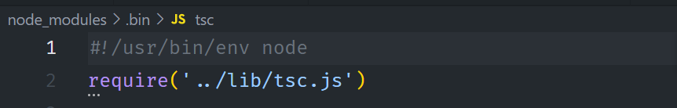

# nodeJS中使用脚本命令时如何传参

>在node环境中，无论我们是通过全局安装还是局部安装的一些可执行的脚本命令，在使用时，其本质都是通过node去执行一段js代码以完成相应的操作， 形如 node abc.js，而我们使用命令时，还可以给脚本传递参数，那么参数是如何处理的呢？

## 普通传参

**经反复测试， node处理脚本参数,除了第一个可执行的命令，以空格分割的任何字符串（除了一些shell的语法）都是参数，并且都被搜集到process.argv属性中：**

> process.argv属性返回一个数组，这个数组包含了启动node进程时的命令行参数。第一个元素为启动node 进程的可执行文件的绝对路径名process.execPath，第二个元素为当前执行的JavaScript文件路径。剩余的元素为其他命令行参数。

**例：自定义脚本命令**

```js
    // scripts/myCommand.js
    console.log('argv', process.argv);
```

package.json中scripts命令：

```json
    {
        "scripts": {
            "myCommand": "node myCommand.js --myName=tanhui mode=dev",
        }
    }
```

现在执行myCommand命令，`npm run myCommand`,process.argv内容如下

```js
[
'C:\\Program Files\\nodejs\\node.exe',
'C:\\Users\\tanh\\Desktop\\app\\scripts\\myCommand.js',
'--myName=sunwukong',
'mode=dev'
]
```

**安装的依赖包提供的命令**

例如在写 `typescript`时常用到的一个命令`tsc`,安装 `typescript` 依赖后会在node_modules的 `.bin`目录中创建一个软链接，指向可执行的脚本文件，这里就是 `tsc` 命令：


代码头部中 `#!/usr/bin/env node`指定的是当前这段代码的执行器为 **node**

现在执行以下命令：`tsc --no-emit --out-file main.js --outDir build`,其实本质相当于是执行了这个命令：`node node_modules/typescript/lib/tsc.js --no-emit --out-file main.js --outDir build`,所以参数依然会被搜集到`process.argv`中。

## 命令行传参

还可以通过命令行传参的方式传递传参数,所谓的命令行传参即是指使用npm run 调用 package.json 中 `scripts` 属性中定义的脚本命令时传递参数：

```js
npm run myCommand --params  // 参数params将转化成process.env.npm_config_params = true
npm run myCommand --params=123 // 参数params将转化成process.env.npm_config_params = 123
npm run myCommand -params  // 等同于--params参数

npm run myCommand -- --params  // 将--params参数添加到process.argv数组中
npm run myCommand params  // 将params参数添加到process.argv数组中
npm run myCommand -- params  // 将params参数添加到process.argv数组中
```

使用命令行传参如果想将参数添加到`process.argv`中，一定要注意添加 `--`

**需要注意的是，如果使用命令行传参，需要知道脚本中到底是怎么处理参数的，到底是使用 npm_config_xxx 这种形式的参数还是使用 process.argv 中的参数**

### 使用yarn执行命令

`yarn`执行命令与`npm run`有所不同，使用`yarn`执行的命令，其参数会被放进`process.argv`中，而不是`process.env.npm_config_xxx`

例：

```shell
yarn run myCommand --port=8080
```
输出process.argv:

```js
[
'C:\\Program Files\\nodejs\\node.exe',
'C:\\Users\\tanh\\Desktop\\app\\scripts\\myCommand.js',
'--port=8080',
]
```

**推荐使用process.argv作为脚本参数来源，可避免如使用yarn与使用 npm run 执行命令时参数传递的差异性**