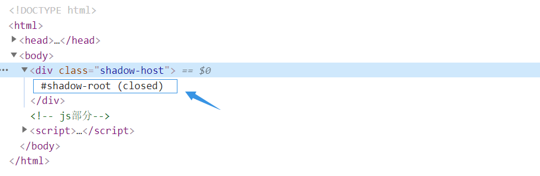
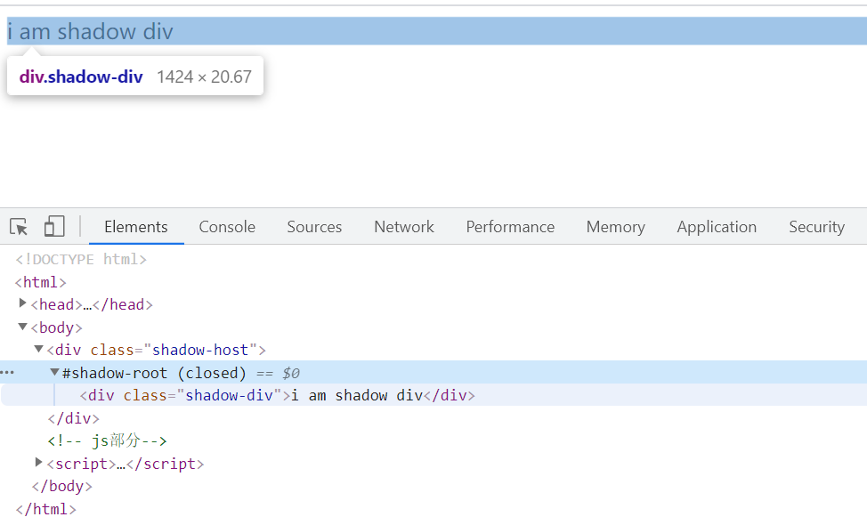
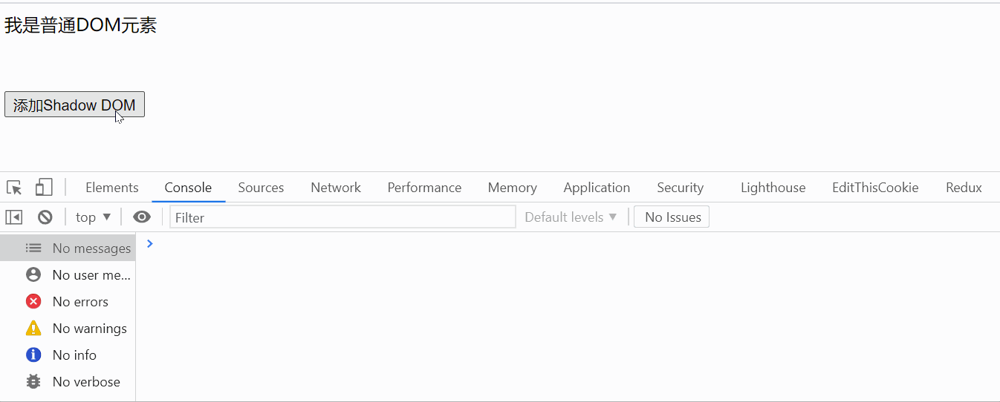
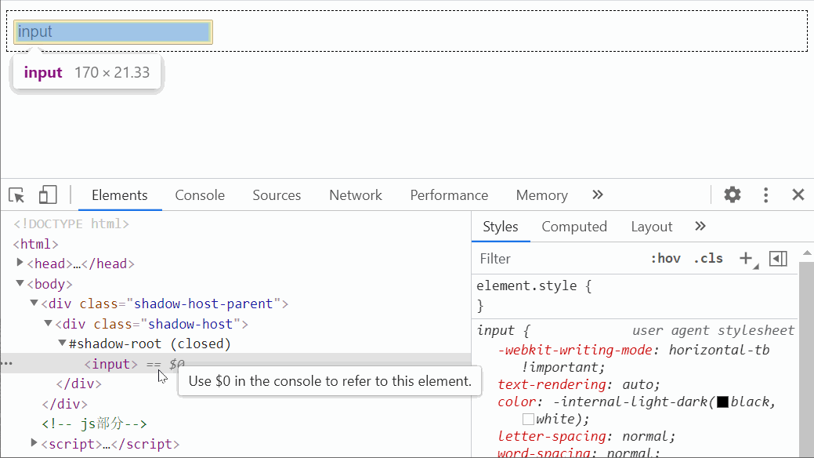
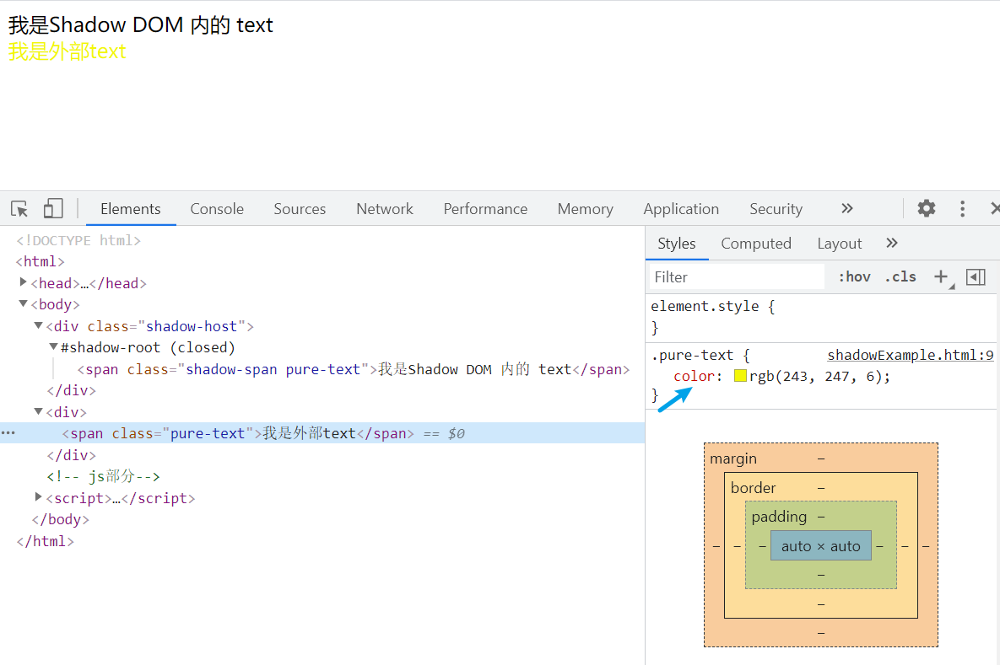
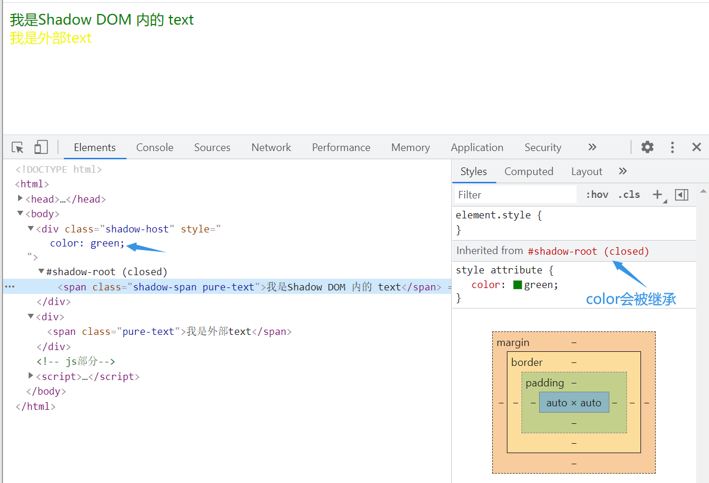
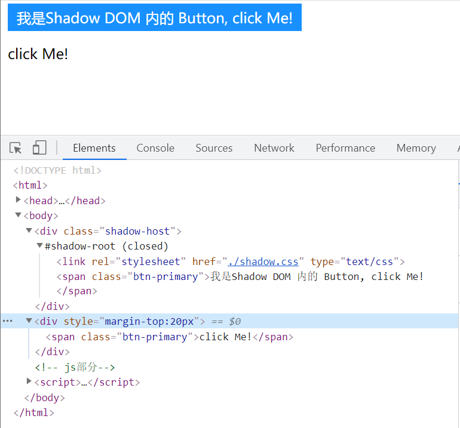
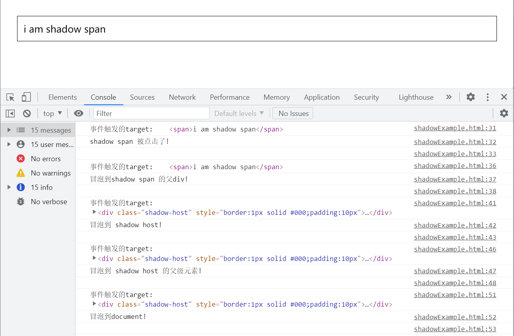

# ShadowDOM

什么是**Shadown DOM**？Shadown DOM属于[web components](https://developer.mozilla.org/zh-CN/docs/Web/Web_Components)技术中的一环，是一个极其关键的接口实现，Shadow DOM 接口可以将一个隐藏的、独立的 DOM 附加到一个元素上,操作Shadown DOM 和操作普通DOM是一样的，Shadow DOM内部可以添加任意**DOM元素**，Shadow DOM 内部的元素始终不会影响到它外部的元素（除了 [`:focus-within`](https://developer.mozilla.org/zh-CN/docs/Web/CSS/:focus-within)），例如添加style元素，只会对Shadow DOM内部元素生效。

## 创建shadow DOM

使用[`Element.shadow()`](https://developer.mozilla.org/zh-CN/docs/Web/API/Element/attachShadow)方法给指定的元素挂载一个**Shadow DOM**,返回对**Shadow Root**的引用，当元素附加了**Shadow DOM**之后的DOM树如下所示：


- Shadow host：一个常规 DOM节点，Shadow DOM 会被附加到这个节点上。
- Shadow tree：Shadow DOM内部的DOM树。
- Shadow boundary：Shadow DOM结束的地方，也是常规 DOM开始的地方。
- Shadow root: Shadow tree的根节点


代码演示：

```html
<!DOCTYPE html>
<html>
    <body>
        <div class="shadow-host"></div>
        <!-- js部分-->
        <script>
            const shadowHost = document.querySelector('.shadow-host');
            const shadowRoot = shadowHost.attachShadow({mode: 'closed'})
        </script>
    </body>
</html>
```

在浏览器中打开此文档，可以看到`div.shadow-host`元素下多出了一个`#shadow-root(closed)`

这里的**closed**来源于创建 Shadow DOM 时的 `{mode: 'closed'}` 选项, `mode` 可选值如下：

- closed: shadowRoot元素不可以由外部js访问到, `Element.shadowRoot`为 null
- open: shadowRoot元素可以由外部js访问到，即通过 `Element.shadowRoot`属性可以访问到此节点



此时 shadow-root 仍然是一个空节点，需要往其中添加一些节点

```html
<!DOCTYPE html>
<html>
    <body>
        <div class="shadow-host"></div>
        <!-- js部分-->
        <script>
            const shadowHost = document.querySelector('.shadow-host');
            const shadowRoot = shadowHost.attachShadow({mode: 'closed'})
            const shadowDiv = document.createElement('div');
            shadowDiv.classList.add('shadow-div');
            shadowDiv.innerText = 'i am shadow div'
            shadowRoot.appendChild(shadowDiv)
        </script>
    </body>
</html>
```

此时页面如下：




> 注意：
>
> 当给一个普通元素附加Shadow DOM后，其原本所包含的所有普通DOM元素都会失效，一个普通元素下不会同时存在Shadow DOM 和 普通 DOM。虽然仍然可以使用js获取到这部分普通元素，但是浏览器不会将其渲染到页面中。

例：

```html
<!DOCTYPE html>
<html>

<body>
    <div class="shadow-host"><span class="origin-span">我是普通DOM元素</span></div>
    <button style="margin-top: 50px;">添加Shadow DOM</button>
    <!-- js部分-->
    <script>
        const btn = document.querySelector('button');
        btn.onclick = attachShadow;
        function attachShadow() {
            const shadowHost = document.querySelector('.shadow-host');
            const shadowRoot = shadowHost.attachShadow({ mode: 'closed' });
            const shadowDiv = document.createElement('div');
            shadowDiv.classList.add('shadow-div');
            shadowDiv.innerText = '我是 shadow div';
            shadowRoot.appendChild(shadowDiv);
            console.log('已附加Shadow DOM')
            // 获取原本存在的普通DOM元素
            console.log('shadowRoot下的普通DOM > origin-span: ', document.querySelector('.origin-span'))
        }
    </script>
</body>

</html>
```

DOM元素附加Shadow DOM:



## Shadow DOM的隔离特性

上面说到，Shadow DOM 内部的元素始终不会影响到它外部的元素（除了 [`:focus-within`](https://developer.mozilla.org/zh-CN/docs/Web/CSS/:focus-within)）。接下来就来探究Shadow DOM中的元素与外部普通DOM元素究竟有何关联。

### focus-within

先说一下`focus-within`：是一个[CSS](https://developer.mozilla.org/zh-CN/docs/Web/CSS) [伪类](https://developer.mozilla.org/zh-CN/docs/Web/CSS/Pseudo-classes) ，表示一个元素获得焦点，或，该元素的后代元素获得焦点。也就是说即便是`Shadow DOM`，当其获得焦点时，也会使得外部的父级DOM元素上的`focus-within`生效。下面用代码验证一下：

```html
<!DOCTYPE html>
<html>
<head>
    <meta http-equiv="X-UA-Compatiple" content="IE=edge">
    <title>test</title>
    <style>
        .shadow-host-parent:focus-within {
            padding: 10px;
            background-color: cyan;
        }
        .shadow-host {
            padding: 5px;
            border: 1px dashed black;
        }
        .shadow-host:focus-within {
            background-color: cornflowerblue;
        }
    </style>
</head>
<body>
    <div class="shadow-host-parent">
        <div class="shadow-host"></div>
    </div>
    <!-- js部分-->
    <script>
        attachShadow();
        function attachShadow() {
            const shadowHost = document.querySelector('.shadow-host');
            const shadowRoot = shadowHost.attachShadow({ mode: 'closed' });
            const shadowInput = document.createElement('input');
            shadowInput.value = 'input'
            shadowRoot.appendChild(shadowInput);
        }
    </script>
</body>
</html>
```





### 样式隔离

先说结论：

1. 外部CSS（包含style和外链资源）中被应用在**Shadow Host**元素的样式中（包括继承来的样式）能被继承的属性都会被Shadow DOM中的元素继承，通过选择器无法直接对`Shadow DOM`的元素应用样式。
2. Shadow DOM中`style`或者**引入的CSS**不会对外部元素造成影响

由于`Shadow DOM`天然具有良好的样式隔离特性，所以`Shadow DOM`也是作为了微前端框架**qiankun**中实现样式隔离的一种方案。


例1：外部无法通过类选择器改变 Shadow DOM 内元素样式

可以看到，同样拥有**pure-text**这个 className,但是却只对外部DOM生效。




例2：Shadow Host 元素上的样式能够被继承

上面例子稍微改一下，我给`shadow-host`元素添加一个 `color`样式




例3：Shadow DOM内部应用样式无法改变影响外部元素

在Shadom内引入css文件：

shadow.css

```css
.btn-primary {
    background-color: #1890ff;
    padding: 5px 10px;
    color: #fff;
}
```

html：

```html
<!DOCTYPE html>
<html>
<head></head>
<body>
    <div class="shadow-host"></div>
    <div style="margin-top:20px"><span class="btn-primary">click Me!</span></div>
    <!-- js部分-->
    <script>
        attachShadow();
        function attachShadow() {
            const shadowHost = document.querySelector('.shadow-host');
            const shadowRoot = shadowHost.attachShadow({ mode: 'closed' });
            // 引入shadow.css
            shadowRoot.innerHTML = `
            <head><link rel="stylesheet" href="./shadow.css" type="text/css"></link></head>
            <span class="btn-primary">我是Shadow DOM 内的 Button, click Me!</span>`;
        }
    </script>
</body>
</html>
```

结果如下，只对 Shadow DOM的元素生效：




### 事件传播

Shadow DOM内部的元素事件传播机制与普通DOM并无二致，可以放心的去注册事件。但是事件中的`target`属性却有一点差别。

 `Event.target`属性值为当前触发事件的元素，由 Shadow DOM 触发事件时`Event.target`表现如下：

html:

```html
<!DOCTYPE html>
<html>
<body>
    <div class="shadow-host-parent" style="padding: 20px">
        <div class="shadow-host" style="border:1px solid #000;padding:10px"></div>
    </div>
    <!-- js部分-->
    <script>
        attachShadow();
        function attachShadow() {
            const shadowHostParent = document.querySelector('.shadow-host-parent')
            const shadowHost = document.querySelector('.shadow-host');
            const shadowRoot = shadowHost.attachShadow({ mode: 'open' });
            const shadowDiv = document.createElement('div');
            const shadowSpan = document.createElement('span');
            shadowSpan.innerText = 'i am shadow span';
            shadowDiv.appendChild(shadowSpan);
            shadowRoot.appendChild(shadowDiv);

            shadowSpan.onclick = function (e) {
                console.log('事件触发的target: ', e.target)
                console.log('shadow span 被点击了!');
                console.log('')
            }
            shadowDiv.onclick = function (e) {
                console.log('事件触发的target: ', e.target)
                console.log('冒泡到shadow span 的父div!');
                console.log('')
            }
            shadowHost.onclick = (e) => {
                console.log('事件触发的target: ', e.target)
                console.info('冒泡到 shadow host!');
                console.log('')
            }
            shadowHostParent.onclick = (e) => {
                console.log('事件触发的target: ', e.target)
                console.log('冒泡到 shadow host 的父级元素!');
                console.log('')
            }
            document.onclick = function (e) {
                console.log('事件触发的target: ', e.target)
                console.log('冒泡到document!');
                console.log('')
            }
        }
    </script>
</body>
</html>
```

当点击时，输出如下：



当事件还在 Shadow DOM 内部传播时，`Event.target`准确的反映了当前触发事件的元素，而当事件传播一旦到达 **Shadow Host**后，后续的事件 `Event.target`则变为了 **Shadow Host**元素，可能这也是作为一种保护机制，不能在外部直接拿到Shadow DOM内部的元素。

我也测试了在事件捕获阶段执行事件函数，`Event.target`表现与冒泡阶段一致。

**所以需要注意，如果在 Shadow DOM 的外部采用了事件委托机制，则无法通过`Event.target`准确的判断目标事件元素**。

## 参考链接

[MDN Shadow DOM](https://developer.mozilla.org/zh-CN/docs/Web/Web_Components/Using_shadow_DOM)
