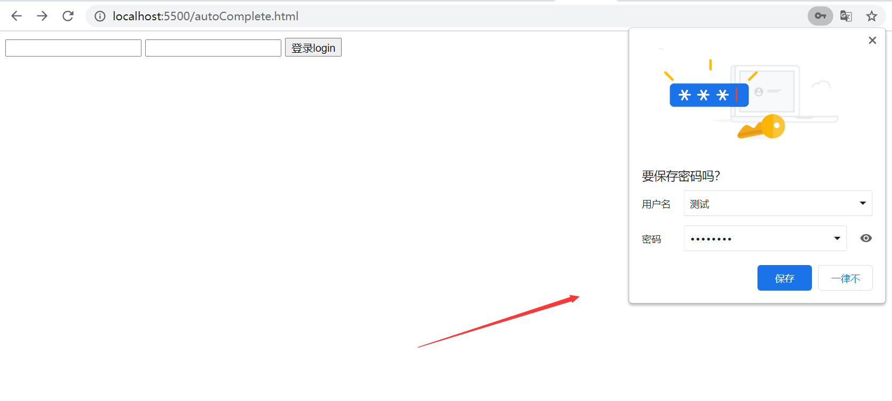

# 如何处理浏览器的密码自动填充问题

现代浏览器一般都具有密码管理功能，当在一个网站中登录后能够记住密码，当下次再进入相同的网站时，会自动填充账号密码，这本身是一个非常好的功能，可以简化日常上网登录的操作，但是某些时候确实不想要浏览器自动填充，这就需要做点处理了。

## 什么时候会调起保存密码的弹窗

以下结论均在chrome90版本环境中测试得出：

当页面中至少包含一对`<input type="text">` `<input type="password">`时（`<input type="text">`一定要在`<input type="password">`之前，但非必须要求紧邻，中间可以穿插其他元素），并且被这两种类型的输入框值不为空时（**text input** 不能为纯数字），当有多个**text input**或多个**password input**时，浏览器会**将最后一个非空的 text input 和 password input 视为账号输入框和密码输入框**。

1. 当刷新页面（非手动在浏览器中刷新）时，会弹出保存账号密码的提示框
2. 当浏览器栏的地址变化（如hash变化或search参数变化）并且伴随**被浏览器视为账号输入框和密码输入框**的元素被移除时，会弹出保存账号密码的提示框

chrome中表现如下：



## 如何禁用自动填充

要想知道如何禁用浏览器自动填充，首先就要了解浏览器自动填充的机制

> 当此网站在浏览器中有保存过的账户密码，浏览器在页面中检测到相邻（不一定是紧邻）的 `<input type="text">`和`<input type="password">`时，会自动填充账号和密码

禁用方案：

1. 使用`autocomplete="off"`

   设置`autocomplete="off"`后，就是告诉浏览器不要为了以后在类似表单上自动填充而保存用户输入的数据，但浏览器不一定遵守此规则

2. 使用`autocomplete="new-password"`

   设置此属性可以禁止浏览器自动自动填充，已被多数现代浏览器支持。具体兼容性参考此连接：[autocomplete="new-password"](https://wiki.developer.mozilla.org/en-US/docs/Web/HTML/Attributes/autocomplete#Browser_compatibility)

3. 使用readonly

   通过在input元素上添加readonly属性，则浏览器不会自动填充。在input的focus事件中删除 readonly 属性，以支持正常的编辑填写。

4. 在相邻的`<input type="text">`和`<input type="password">`中间插入一对隐藏的 **text input **和**password input**

   通过这种方式可以迷惑浏览器，让浏览器在这对隐藏的`<input type="text"><input type="password"`元素上自动填充，而不影响真实使用的input

   注意，这里的隐藏只能通过改变透明度或者位置等来实现隐藏，不能直接使用`display:none`和`visibility:hidden`进行隐藏，否则无法达到效果

   ```html
   <!DOCTYPE html>
   <html>
       <style>
           .hidden {
               position: absolute;
               left: -10000px;
               top: -10000pv;
               opacity: 0;
               z-index: -1;
           }
       </style>
       <body>
           <form>
               <input type="text">
               <!-- 隐藏的text input 和 password input, 浏览将会自动填充以下两个元素 -->
               <input type="text" class="hidden">
               <input type="password" class="hidden">
   			<!-- 分割线 -->
               <input type="password">
           </form>
       </body>
   </html>
   ```
