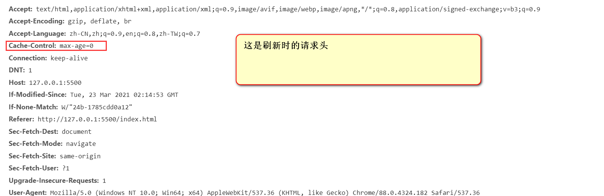
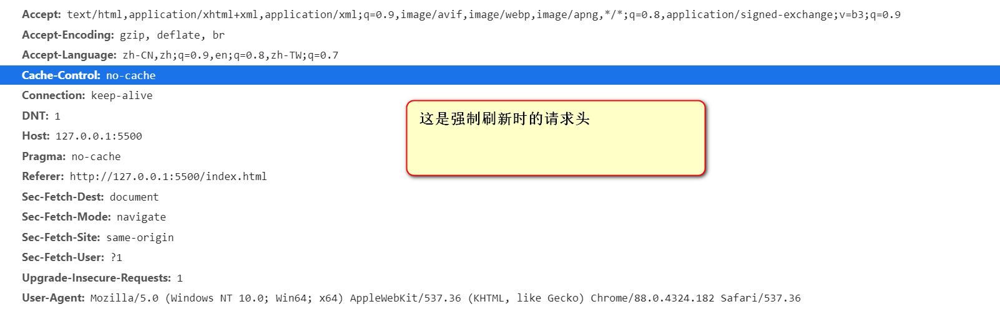
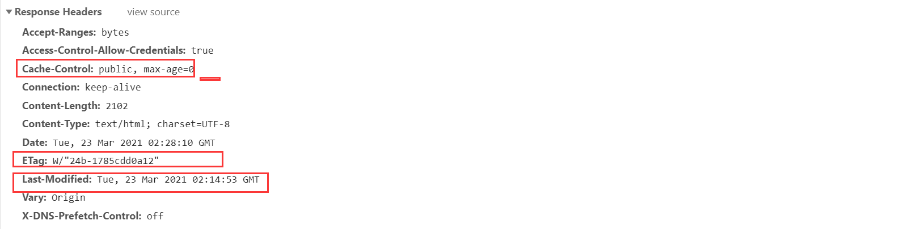
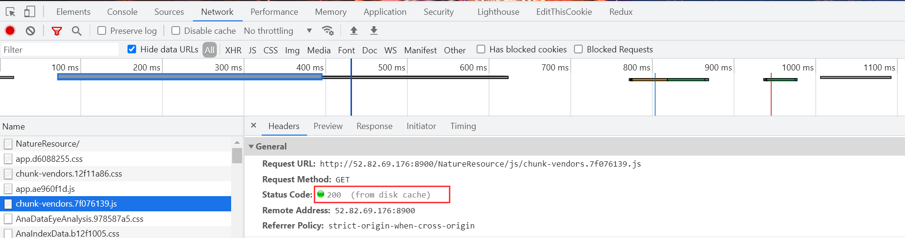

# cache_policy

## 一、浏览器中刷新与强制刷新的区别

以本地测试服务器为例：

浏览器在**刷新**时，请求头如下

重点关注头部中的`Cache-control:max-age=0`

浏览器在**强制刷新**时，请求头如下

重点关注头部中的`Cache-Control：no-cache`

可以看到，这两种刷新方式的`Cache-Control`是有区别的

在请求头中：

`Cache-Control: no-cache` :  表示不想使用缓存（无论本地是否有缓存），我要直接向服务器取最新的结果

`Cache-Control: max-age=0` : 表示本地缓存已经不是最新的了（无论本地缓存是否过期），需要重新向服务器验证（协商缓存）

当在请求头中使用 `Cache-Control：no-cache`时,浏览器不会再发送`If-Modified-Since`和`If-None-Match` 请求头，意味着一定要重新请求新资源

可以得出结论，在浏览器刷新和强制刷新时，都不会直接走本地缓存，而是会向服务器进行验证

那么如何验证当前缓存资源是否已失效呢？这就要说到**协商缓存**了

##　二、协商缓存

在HTTP/1.1规范中，主要使用两个头部字段来确定资源是否变动，分别为`If-Modified-Since`和`If-None-Match`

请求资源的响应头如下：

响应头如下：

​

响应头中的`Last-Modified`和`ETag`：

1. Last-Modified： 标识资源最后更新时间
2. ETag：通过摘要算法计算出来的资源标识

当浏览器发送请求的请求头中包含`If-Modified-Since`和`If-None-Match`时，即需要与服务端确认资源的新鲜度，`If-Modified-Since`字段的值即为上一次从请求缓存到本地资源时的头部信息中`Last-Modified`的值,而`If-None-Match`字段的值则为上一次缓存资源时的头部信息中的`ETag`字段的值。当请求头中同时发送了`If-Modified-Since`和`If-None-Match`字段时，`If-None-Match`具有更高的优先级。

当`If-Modiffied-Since`的值与资源最后更新时间比较相同，即判断可以使用缓存，服务端状态码返回304，浏览器继续使用本地缓存

当`If-None-Match`与服务端中的最新资源的标识相同时，即判断可以使用缓存，服务端状态码返回304， 浏览器继续使用本地缓存

通过`If-None-Match`确认的结果准确度更高，因为有可能文件资源的最后更新时间改变了，但是内容却没有改变，这样使用`If-Modified-Since`去判断就无法使用缓存，需要重新发送一次相同的资源。

## 三、cache_policy

1. 当请求的响应头中没有与缓存相关的头部字段时，例如：`Cache-Control`、`Exppires`,浏览器会缓存对应资源吗？

   当没有设置缓存策略的头部字段时，浏览器会根据响应头中是否有`Last-Modified`字段决定是否要缓存，如果有则会被缓存，因为当什么缓存策略都没有设置的时候，浏览器会采用一个启发式的算法，通常会取响应头中的 Date 减去 Last-Modified 值的 10% 作为缓存时间。

2. `cache-control`常用值：

   （1）**public**：所有内容都将被缓存（客户端和代理服务器都可缓存）

   （2）**private**：所有内容只有客户端可以缓存，**Cache-Control的默认取值**

   （3）**no-cache**：客户端缓存内容，但是是否使用缓存则需要经过协商缓存来验证决定

   （4）**no-store**：所有内容都不会被缓存，即不使用强制缓存，也不使用协商缓存

   （5）**max-age=xxx (xxx is numeric)**：缓存内容将在xxx秒后失效

3. 协商缓存与强缓存

- 协商缓存：指需要跟服务器确认资源的新鲜度，如果资源未更新，则返回304状态码，告知浏览器使用本地缓存

- 强缓存：直接走本地缓存，不经过服务端，不会向服务端发起请求，状态码为200，但是在network面板中可以看见**from disk cache**或者 **from memory cache**标识。

  
