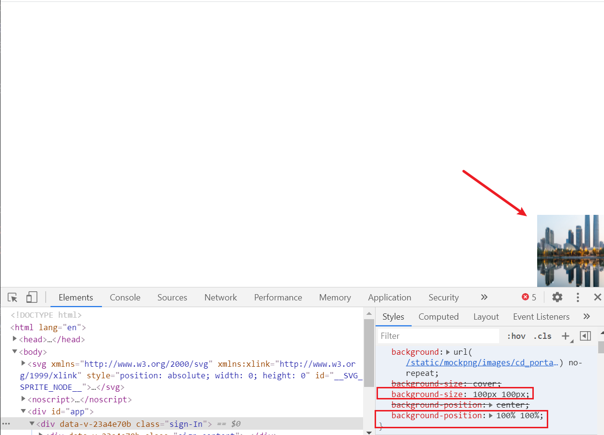
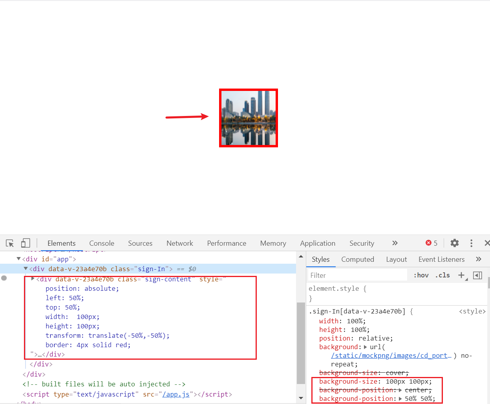
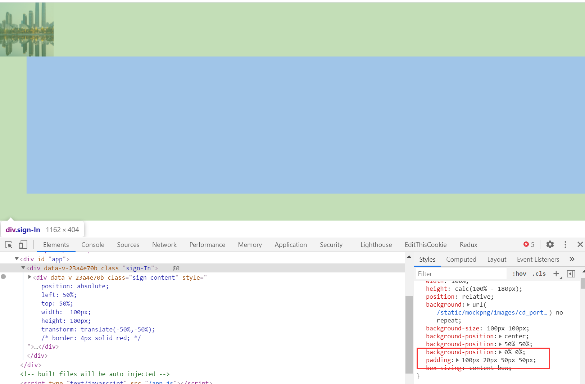
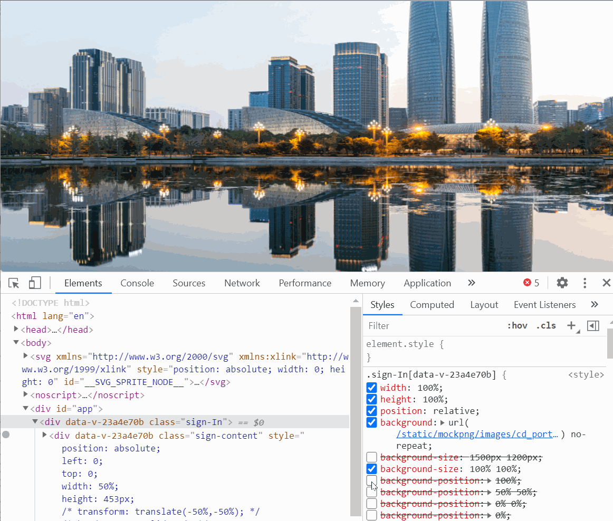

# 详解background-position

 这两天在项目中替换首页图片的时候，发现了一个问题，之前的样式设置的是background-position:center,当页面缩小或者放大时背景图显示的区域也会变化，现在改成left top后，页面如何变化大小图片位置都没动。这一想，也不对啊，background-position:center难道不是从元素居中位置才显示背景图吗，为什么还是占满了全部元素区域？这个center到底指的是背景图的center还是元素的center？

## background-position属性

background-position为一个集合属性，设置的是背景图的起始位置，分别为`background-position-x`和`background-position-y`,可用的值有`left`,`right`,`top`,`bottom`,以及固定像素值和百分比值。

- background-position-x: left （等价于0%）
- background-position-x: right （等价于100%）
- background-position-y: top （等价于0%）
- background-position-x: bottom （等价于100%）

抛开固定像素值定位，那么这次主要探究百分比值对背景图位置的影响，百分比值正常来看应该是相对于元素的宽高的百分比，然而实际表现却不是如此。

实际示例：

注：此次用作背景元素容器的元素宽高设置为`100%`，`100%`，且无`border`和`padding`

例1：



```css
background-size: 100px 100px;
background-position: 100% 100%;
```

可以看到，当background-position设置为百分之百的时候，背景图在窗口的右下角显示。

接下来改变位置

例2：



```css
background-size: 100px 100px;
background-position: 50% 50%;
```

可以看到，现在背景图现在处于元素正中央的位置，为了证实是正中央的位置，我用了一个具有居中样式的子元素做对比，可以看到正好被子元素框柱。

通过以上两例可以看出:

当`background-position`设置为`100% 100%`的时候，图片在最右下角位置，那么此时`background-position-x`的像素值等于**容器元素的宽度值减去背景图的宽度**，`background-position-y`的像素值等于**容器元素的高度值减去背景图的高度**；

当`background-position`设置为`50% 50%`的时候，图片在最右下角位置，那么此时`background-position-x`的像素值等于**容器元素的宽度值乘以50%再减去背景图宽度的50%**，`background-position-y`的像素值等于**容器元素的高度值乘以50%再减去背景图高度的50%**；

如果用`w`代表容器元素宽度，`h`代表容器元素高度，`bw`代表背景图宽度，`bh`代表背景图高度，通过以上两例可以得出这么一个公式：

> background-position-x: percent =  (w - bw) * percent <br> background-position-y: percent = (h - bh) * percent

在元素有padding的情况下：



```css
padding: 100px 20px 50px 50px;
background-position: 0% 0%;
```

可以看到背景图是在padding区域的左上角，所以`background-position`的百分值实际参与计算的容器元素宽高 = `content + padding`

如果背景图尺寸`background-size`设置为`100% 100%`的话，那么`background-position`不论设置为何种百分比都不会发生偏移

反之，如果背景图尺寸大于元素尺寸，则设置百分比后发生的就是负向偏移了。

